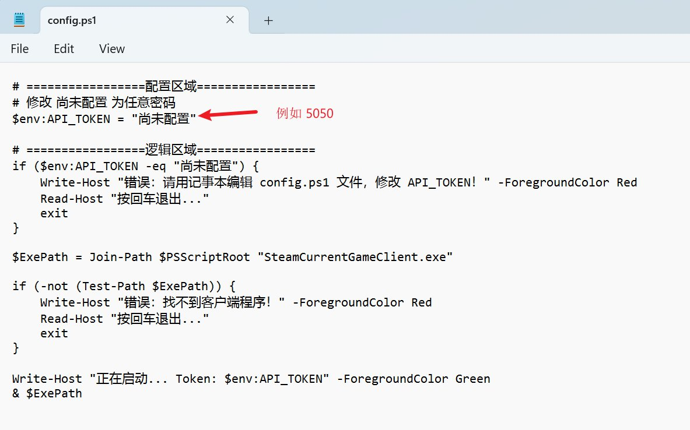
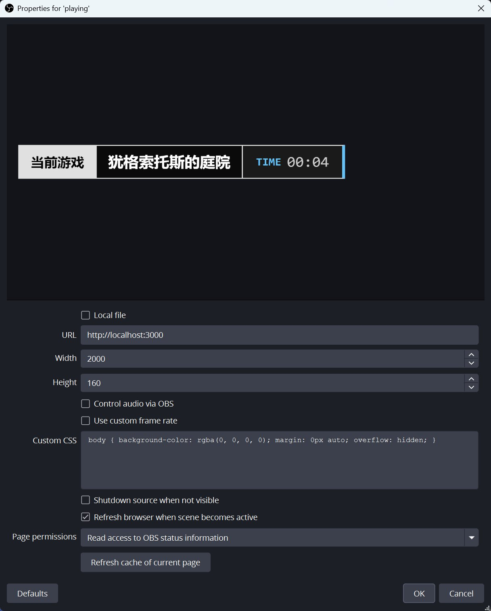

## Steam Current Game Overlay for OBS

用于显示当前 Steam 正在运行的游戏名称。


## 原理
通过读取注册表获取本机正在运行的 Steam 游戏的 AppID。

之后调用 Steam Store API 获取游戏名称。

最后通过一个本地 HTTP 服务器提供一个网页接口，OBS 通过浏览器源加载该网页并显示游戏名称。


## 配置

环境变量
```shell
// steam api 地址，默认为官方地址。
// 如果需要在大陆使用，请配置为反代地址。
// @rate-limit: 每天 100,000 次请求。
STEAM_API_URL="https://store.steampowered.com"

// 监听地址，默认为本地 3000 端口。
LISTEN_ADDRESS="localhost:3000"

// 访问密码，用于将自己的游玩状态与其他人区分开
// 必须配置
API_TOKEN=XXXX

// 自行搭建的服务器
SERVER_URL=http://jp.kuriko.moe:3000
```


## 使用说明

解压所有文件

用记事本打开 config.ps1 文件，修改 `API_TOKEN` 为任意密码（例如 5050）




双击 `启动.bat`，此时会弹出一个黑底的命令提示符，上面是程序运行的日志


打开 OBS，如图配置：



## TODO

- [x] 支持自适应长度
- [x] 支持显示游戏时长
- [ ] 支持显示游戏图标
- [ ] 自定义显示模板（代码架构上支持了）
