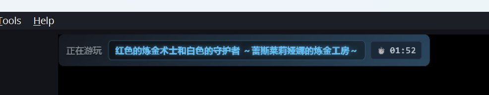
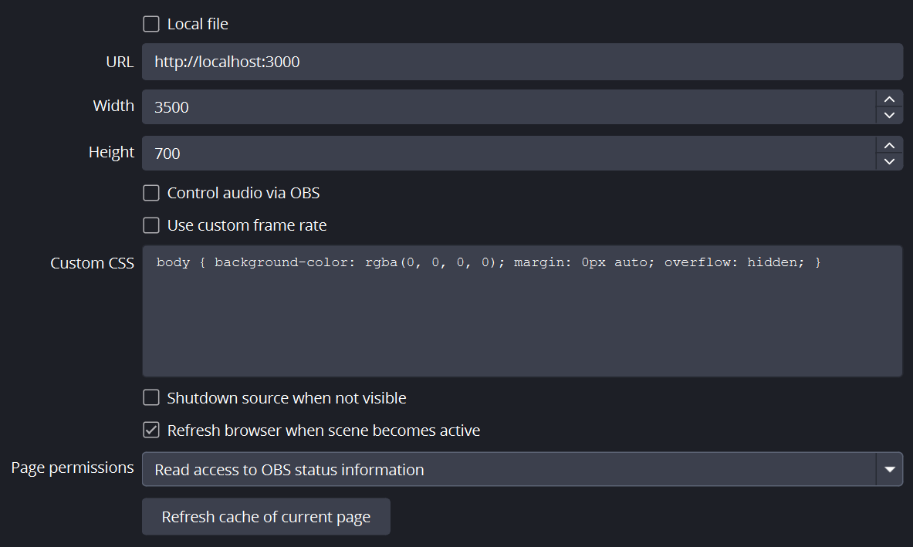

## Steam Current Game Overlay for OBS

用于显示当前 Steam 正在运行的游戏名称。




## 原理
通过读取注册表获取本机正在运行的 Steam 游戏的 AppID。

之后调用 Steam Store API 获取游戏名称。

最后通过一个本地 HTTP 服务器提供一个网页接口，OBS 通过浏览器源加载该网页并显示游戏名称。


## 配置

环境变量
```
/*
  steam api 地址，默认为官方地址。
  如果需要在大陆使用，请配置为反代地址。
  @rate-limit: 每天 100,000 次请求。
*/
STEAM_API_URL="https://store.steampowered.com"

// 监听地址，默认为本地 3000 端口。
LISTEN_ADDRESS="localhost:3000"
```

### OBS 配置



## TODO

- [ ] 支持显示游戏图标
- [ ] 支持显示游戏时长
- [ ] 自定义显示模板
